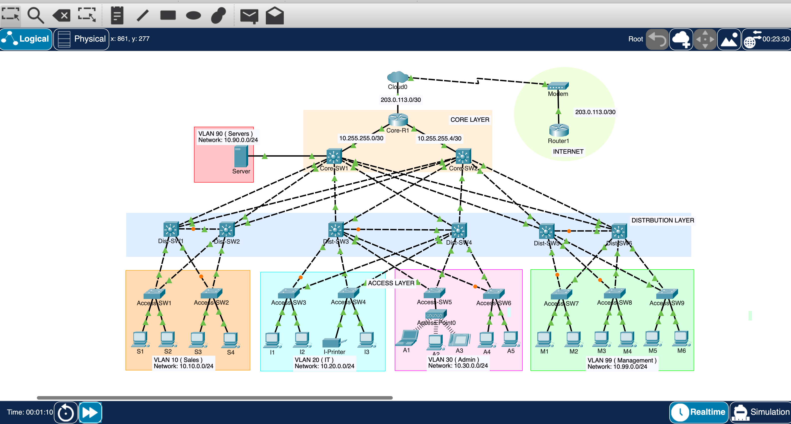
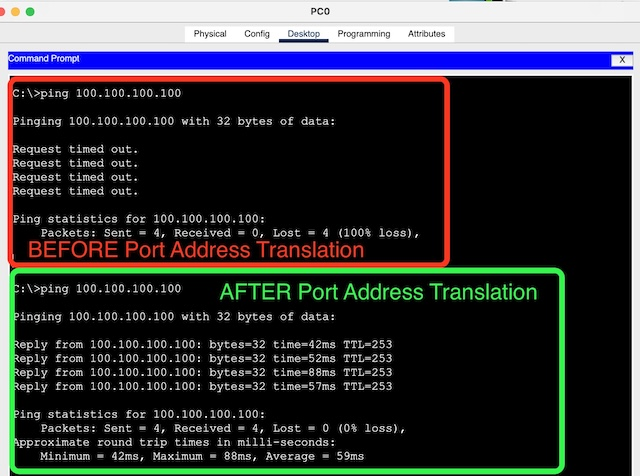
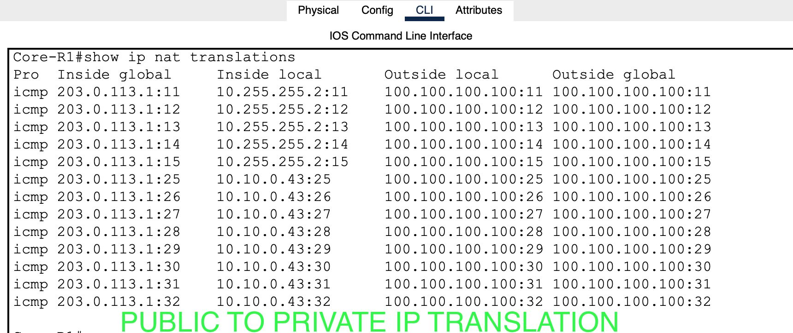
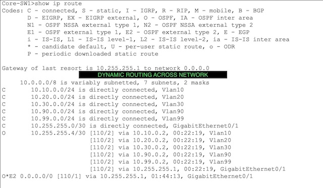

# Enterprise-Hierarchical-Network

## 📌 Project Overview
This project demonstrates the implementation of a scalable, redundant, and secure enterprise network using a three-tier hierarchical model (Core, Distribution, and Access). The design ensures high availability and efficient traffic management for a multi-departmental organization.

## 📊 Network Topology

## 🛠️ Technical Specifications
### 1. Network Architecture
- Hierarchical Layers: Core (High-speed switching), Distribution (Policy-based connectivity), and Access (End-user connectivity).
- Segmentation: Implemented five distinct VLANs for Staff, IT, Admin, Servers, and Management to reduce broadcast domains.
- Redundancy: Configured Rapid PVST+ with Core-SW1 and Core-SW2 acting as primary/secondary roots to ensure a loop-free environment with optimized load balancing

### 2. Routing & Connectivity
- Dynamic Routing: OSPF Area 0 is configured across the Core Layer to facilitate fast convergence and sub-second path recovery.
- Inter-VLAN Routing: Managed via SVI (Switched Virtual Interfaces) on multi-layer switches, providing default gateways for all internal subnets.
- Edge Services: The Core Router (Core-R1) provides a static default route redistributed into the OSPF domain.

### 3. Infrastructure Services
- DHCP Services: Core-R1 acts as a centralized DHCP server for Staff, IT, and Admin VLANs.
- DHCP Relay: Configured ip helper-addresses on SVIs to relay broadcast requests to the central server across Layer 3 boundaries.
- Security (NAT): Implemented PAT (Port Address Translation) to map the internal 10.0.0.0/8 private address space to a single public IP (203.0.113.1) for secure internet access.

### 📊 Verification Results
- Connectivity: Successful end-to-end ICMP pings from the Access Layer to external internet addresses (100.100.100.100).

- Translation: Verified active NAT translation tables on the Core Router showing successful internal-to-external mapping.

- Routing Table: Confirmed OSPF-learned routes and the Gateway of Last Resort are correctly populated on all Layer 3 devices.

